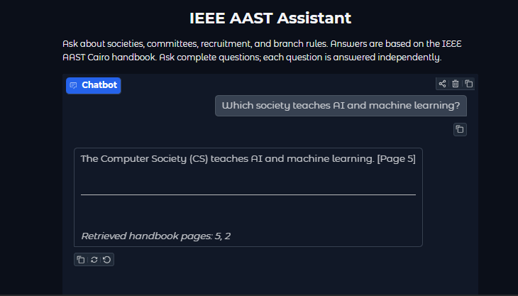

# IEEE AAST RAG Chatbot

A Python chatbot that answers questions about IEEE AAST Cairo societies,
committees, recruitment, and branch rules using a handbook as its
knowledge source.

Built as a student project using Retrieval-Augmented Generation (RAG),
pretrained language models, and a streaming Gradio interface.
This is an educational prototype, not an official IEEE service.

## Overview

The chatbot retrieves relevant handbook pages before generating an answer.
This provides the language model with document-specific evidence instead
of relying only on its general knowledge.

The project uses pretrained models without fine-tuning.

## Features

- PDF text extraction with page metadata.
- Overlapping text chunks for semantic search.
- Embedding-based retrieval using cosine similarity.
- Full-page expansion to preserve surrounding context.
- Cross-encoder reranking of candidate pages.
- Answers prompted to stay within the supplied handbook context.
- Streaming responses through a Gradio chat interface.
- Retrieved page numbers displayed below responses.

## How It Works

### Document preparation

1. Upload the handbook PDF.
2. Extract text and preserve page numbers.
3. Remove repeated footers and unnecessary whitespace.
4. Split each page into chunks of up to 120 words with 25-word overlap.
5. Generate normalized embeddings for the chunks.

The tested handbook produced 21 chunks with 384-dimensional embeddings.

### Answering a question

1. Encode the question using the embedding model.
2. Search the chunk embeddings and retrieve the top 8 candidates.
3. Expand candidate chunks to their full source pages.
4. Remove duplicate pages.
5. Rerank the pages against the question.
6. Select up to 2 pages as context.
7. Combine the context, question, and answering instructions.
8. Generate and stream the answer.

Embeddings are stored in a NumPy array. A separate vector database
is unnecessary for this small document collection.

## Models and Tools

| Component | Model or library | Role |
|---|---|---|
| PDF extraction | pypdf | Read handbook text |
| Embeddings | sentence-transformers/all-MiniLM-L6-v2 | Represent text numerically |
| Similarity search | NumPy | Rank chunk embeddings |
| Reranking | cross-encoder/ms-marco-MiniLM-L6-v2 | Rank candidate pages |
| Answer generation | Qwen/Qwen2.5-1.5B-Instruct | Generate answers from context |
| Model execution | PyTorch and Transformers | Load and run models |
| Interface | Gradio | Display streaming responses |

The embedding model and reranker run on CPU.
The language model runs on GPU using float16.

## Run in Google Colab

The notebook is designed for Google Colab with a GPU runtime
and was tested on a Tesla T4.

1. Download `IEEE_AASTMT_RAG_Chatbot.ipynb` from this repository.
2. Open Google Colab and upload the notebook.
3. Select **Runtime → Change runtime type → T4 GPU**.
4. Select **Runtime → Run all**.
5. Upload your authorized copy of the handbook when prompted.
6. Wait for package installation, model downloads, and tests to finish.
7. Open the Gradio link printed by the final cell.

The notebook includes its installation commands.
Internet access is required for package and model downloads.

The Gradio link is temporary and depends on the Colab runtime
remaining active. GPU availability is subject to Colab limits.

## Knowledge Source

The project was developed using the IEEE AAST Cairo Student Branch
handbook.

The handbook is not bundled with this repository. Users must provide
an authorized copy when running the notebook.

The notebook can extract text from readable PDFs; scanned documents
would require an additional OCR step.

## Example Questions

- What are the steps to join IEEE AAST Cairo?
- Which society teaches AI and machine learning?
- What is the difference between IES and PES?
- What does the branding team do?
- What happens after three unexcused absences?
- What is the exact recruitment deadline for 2026?

Ask complete questions. Each question is processed independently.

## Evaluation

The following sample tests were manually reviewed during development:

| Test | Observed result |
|---|---|
| Recruitment process | Included all four stages |
| AI and machine learning society | Identified the Computer Society |
| Three unexcused absences | Answered probation |
| Missing recruitment deadline | Declined to invent a date |
| Out-of-scope general-knowledge question | Declined to answer |
| Inline page citations | Inconsistent |

These are sample checks, not a comprehensive accuracy benchmark.

Initial testing revealed unsupported details in generated answers.
Stricter instructions and examples improved behavior on the evaluated
questions, but do not guarantee that every answer is correct.

## Limitations

- Answers depend on the contents and quality of the supplied handbook.
- The model can still generate unsupported claims.
- Inline citations may be omitted or incorrect.
- Retrieved page numbers show supplied context, not independently
  verified support for every claim.
- Conversation history is displayed but is not used by the model.
- Broad questions may require evidence from more than two pages.
- The interface requires a running Colab session.
- Some dependencies use version ranges or are unpinned, so future
  installations may behave differently.

## Future Improvements

- More extensive retrieval and answer evaluation.
- Better citation validation.
- Conversation-aware retrieval for follow-up questions.
- Support for multiple documents.
- Persistent deployment.
- Fully pinned and tested dependency versions.

## Acknowledgments

Built using Qwen, Sentence Transformers, Hugging Face Transformers,
PyTorch, NumPy, pypdf, and Gradio.
